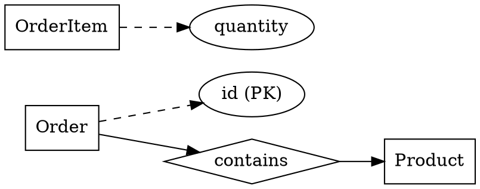

# ER Diagram Extractor (Two-Stage with Evidence)

## Overview

Extract entity-relationship diagrams from papers, SQL, or ORM code using a strict two-stage process with evidence-based classification.

**Core principle:** Every table must be classified with evidence. Every relationship must cite its source. No guessing allowed.

## When to Use

Use when:
- Analyzing database schemas from SQL DDL
- Extracting ER models from academic papers
- Converting ORM code to ER diagrams
- Documenting existing database designs

Do NOT use for:
- Creating new database designs from scratch
- General data modeling discussions

## Two-Stage Process

### Stage 1: Output Pure JSON Only

**CRITICAL:** Output ONLY JSON. No markdown code blocks. No explanatory text. No section headers. Just raw JSON starting with `{`.

**Required structure:**

```json
{
  "entities": [...],
  "relationships": [...],
  "assumptions": [...],
  "questions": [...]
}
```

### Stage 2: Output Pure Graphviz DOT Only

**CRITICAL:** Output ONLY one DOT code block. No section headers. No Mermaid. No ASCII art. No images. Start directly with `digraph`.

## Table Classification (Priority Order)

Classify every table into exactly one category:

### 1. junction_table (Bridge Table)

**Criteria (most must apply):**
- Only 2 main foreign key columns (e.g., a_id, b_id)
- Other columns are minimal: only created_at/updated_at audit fields
- Primary key is (a_id, b_id) composite OR has unique constraint on (a_id, b_id)
- Table name pattern: a_b, a2b, *_map, *_rel

**Example:** `student_course` with only (student_id, course_id, created_at)

### 2. associative_entity_table (Relationship Entity)

**Criteria:**
- Connects entities BUT has significant business attributes: quantity/price/score/status/role/type
- OR has independent primary key `id` AND business attributes

**Examples:**
- `order_item` (has quantity, unit_price)
- `enrollment` (has grade, enrollment_date)
- `user_role` (has role_type, permissions)

### 3. entity_table (Default)

All other cases.

## Classification Evidence (REQUIRED)

Every entity MUST have `classification_evidence` array:

```json
{
  "name": "OrderItem",
  "classification": "associative_entity_table",
  "classification_evidence": [
    "Contains foreign keys order_id and product_id",
    "Has business attributes: quantity, unit_price",
    "Has independent primary key id"
  ]
}
```

## Relationship Source (REQUIRED)

Every relationship MUST have `source` and `evidence`:

**Source types:**
- `"fk"`: Foreign key constraint in SQL
- `"junction_inference"`: Inferred from bridge table pattern
- `"text_inference"`: Extracted from paper text
- `"orm_inference"`: From ORM relationship definitions

**Evidence examples:**

```json
{
  "name": "Order_contains_Product",
  "source": "junction_inference",
  "evidence": [
    "Table order_item contains order_id FK->orders.id",
    "Table order_item contains product_id FK->products.id",
    "order_item has quantity attribute, treated as associative entity"
  ]
}
```

## Mandatory Questions

**MUST ask in `questions` array when:**
- See xxx_id column but no explicit foreign key reference
- Table name looks like bridge table but has many columns
- Multiple candidate primary keys or no primary key defined
- Paper says "one ... can have many ..." but cardinality unclear

**Example:**

```json
{
  "questions": [
    "Table 'user_project' has user_id and project_id but no FK constraints. Are these foreign keys?",
    "Table 'enrollment' has 10+ columns. Is this a bridge table or entity table?",
    "Paper mentions 'students take courses' but doesn't specify if one student can take same course multiple times. What's the cardinality?"
  ]
}
```

## JSON Schema

```json
{
  "entities": [
    {
      "name": "OrderItem",
      "source_name": "order_item",
      "classification": "associative_entity_table",
      "classification_evidence": [
        "Contains FK order_id and product_id",
        "Has business fields quantity and unit_price"
      ],
      "attributes": [
        {
          "name": "id",
          "source_name": "id",
          "type": "int",
          "pk": true,
          "unique": true,
          "nullable": false
        },
        {
          "name": "order_id",
          "source_name": "order_id",
          "type": "int",
          "pk": false,
          "unique": false,
          "nullable": false,
          "fk_to": "Order.id"
        }
      ]
    }
  ],
  "relationships": [
    {
      "name": "Order_contains_Product",
      "type": "many_to_many",
      "from": "Order",
      "to": "Product",
      "via_entity": "OrderItem",
      "cardinality": null,
      "relationship_attributes": [
        {"name": "quantity", "source_name": "quantity", "type": "int"}
      ],
      "source": "junction_inference",
      "evidence": [
        "table order_item contains order_id FK->order.id",
        "table order_item contains product_id FK->product.id"
      ]
    }
  ],
  "assumptions": [],
  "questions": []
}
```

## Graphviz DOT Rules

**Entity representation:**
- `entity_table` → Rectangle
- `associative_entity_table` → Rectangle (can also show as relationship diamond)
- `junction_table` → Relationship diamond (use semantic name like "enrolls_in", "contains")

**Node ID prefixes:**
- Entities: `E_`
- Attributes: `A_`
- Relationships: `R_`

**Layout:**
- `rankdir=LR` (left to right)
- Attributes connected with dashed lines
- Primary keys marked

**Example:**



## Common Mistakes

| Mistake | Fix |
|---------|-----|
| Using Mermaid format | Use Graphviz DOT only |
| No classification_evidence | Add evidence array for every entity |
| No relationship source/evidence | Add source and evidence for every relationship |
| Guessing cardinality | Put in questions array if uncertain |
| Mixing JSON with explanatory text | Stage 1 outputs ONLY JSON, nothing else |
| Adding markdown code blocks around JSON | Output raw JSON directly |
| Adding section headers like "Stage 1:" | Start directly with `{` for JSON or `digraph` for DOT |

## Red Flags - STOP and Fix

- Output contains "```mermaid"
- Output contains "```json" (Stage 1 should be raw JSON)
- Entity missing classification_evidence
- Relationship missing source or evidence
- Uncertain about FK but didn't ask question
- Using ASCII art or images

**All of these mean: Delete output. Start over following the two-stage rules.**

## Rationalization Table

| Excuse | Reality |
|--------|---------|
| "Mermaid is easier to read" | Requirement is Graphviz DOT. No exceptions. |
| "Classification is obvious" | Must provide evidence anyway. |
| "I'm pretty sure it's a FK" | If not explicit, ask in questions. |
| "JSON code block is cleaner" | Stage 1 requires raw JSON, no markdown. |
| "I'll combine both stages" | Two stages are mandatory. Separate outputs. |
