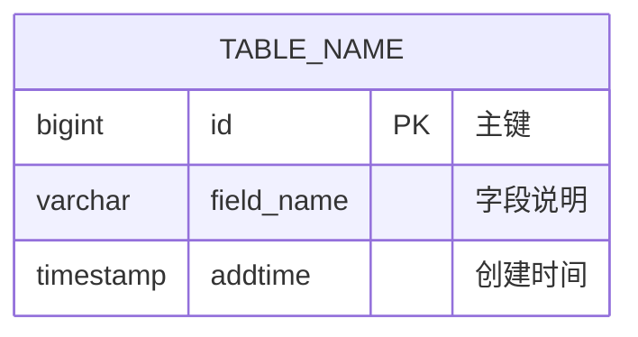
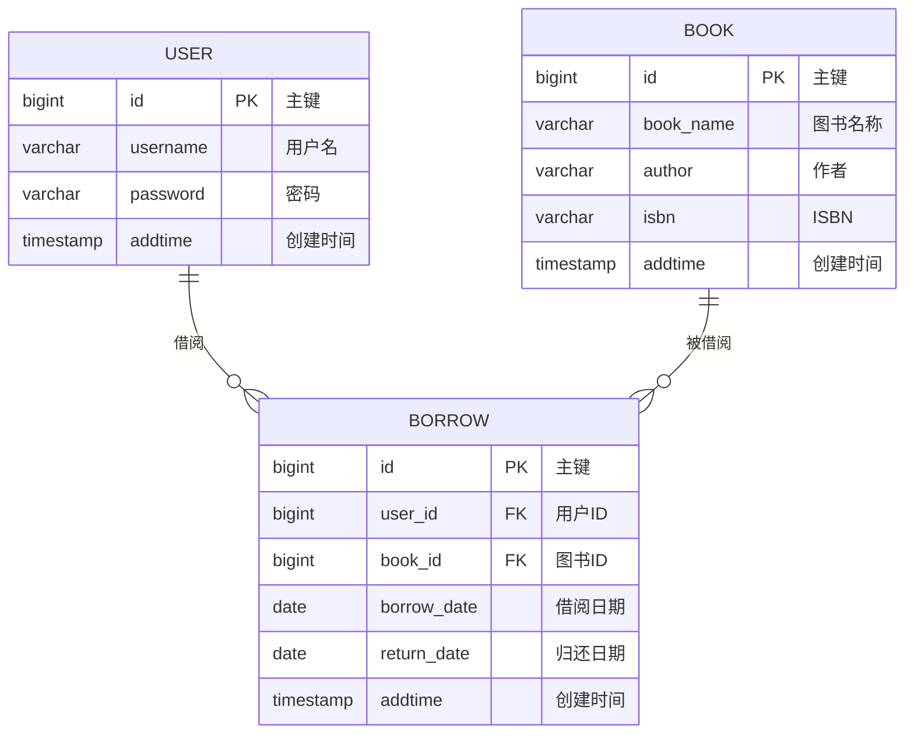

# Paper Generator Skill

Base directory for this skill: `~/.claude/skills/paper-generator`

## When to use
- 用户要求生成毕业论文大纲
- 用户要求设计数据库表结构
- 用户要求绘制ER图
- 用户要求生成完整的论文框架

## Workflow

### 1. 生成论文大纲
根据标准7章结构生成论文大纲：
- 第一章：绪论
- 第二章：相关技术介绍
- 第三章：系统需求分析
- 第四章：系统设计
- 第五章：系统实现
- 第六章：系统测试
- 第七章：总结与展望

### 2. 设计数据库表
根据系统功能模块设计数据库表：
- 必备字段：id (bigint, 主键), addtime (timestamp)
- 根据业务需求添加其他字段
- 遵循命名规范和类型规范

### 3. 生成ER图
使用Mermaid格式生成美观的ER图：


### 4. 输出格式
- Markdown格式的论文大纲
- Markdown表格格式的数据库表设计
- Mermaid格式的ER图
- 可选：DOCX格式的完整论文框架

## Tools

### analyze_papers.py
分析现有论文的结构和数据库表设计
```bash
python3 /Users/zhishixuebao/Desktop/外包项目/er图流程/analyze_papers.py
```

### generate_template.py
生成通用论文模板
```bash
python3 /Users/zhishixuebao/Desktop/外包项目/er图流程/generate_template.py
```

### generate_er_diagram.py
从数据库表设计生成ER图
```bash
python3 /Users/zhishixuebao/Desktop/外包项目/er图流程/generate_er_diagram.py
```

## Dependencies
- python3
- python-docx (for reading .docx files)
- json (built-in)

## Environment
No required environment variables.

## Quality expectations
- 论文结构完整，符合学术规范
- 数据库表设计合理，字段类型正确
- ER图清晰美观，关系明确
- 输出格式规范，易于编辑

## Examples

### Example 1: 生成管理系统论文大纲
```
用户: 帮我生成一个"基于SpringBoot的图书管理系统"的论文大纲

输出:
# 基于SpringBoot的图书管理系统设计与实现

## 第一章 绪论
### 1.1 研究背景
### 1.2 研究意义
### 1.3 国内外研究现状

## 第二章 相关技术介绍
### 2.1 Java编程语言
### 2.2 SpringBoot框架
### 2.3 MySQL数据库
### 2.4 MyBatis-Plus框架

...
```

### Example 2: 设计数据库表
```
用户: 为图书管理系统设计数据库表

输出:
## 图书表 (book)
| 字段名称 | 类型 | 长度 | 字段说明 | 主键 | 默认值 |
|---------|------|------|---------|------|--------|
| id | bigint | | 主键 | 主键 | |
| addtime | timestamp | | 创建时间 | | CURRENT_TIMESTAMP |
| book_name | varchar | 200 | 图书名称 | | |
| author | varchar | 100 | 作者 | | |
| isbn | varchar | 50 | ISBN | | |
| category | varchar | 100 | 分类 | | |
| price | decimal | 10,2 | 价格 | | |
| stock | int | | 库存 | | 0 |

...
```

### Example 3: 生成ER图
```
用户: 生成图书管理系统的ER图

输出:

```

## Integration with Claude+Codex

当使用Claude+Codex协同模式时：
- Claude负责：分析需求、设计架构、撰写文档
- Codex负责：生成代码、创建表结构、绘制图表

启动命令：
```bash
OMX_TEAM_WORKER_CLI_MAP='claude,codex' \
OMX_TEAM_WORKER_LAUNCH_ARGS='--model gpt-4.5' \
omx team 2:executor "生成[系统名称]的完整论文框架和数据库设计"
```
