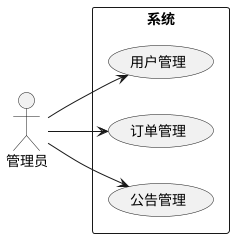
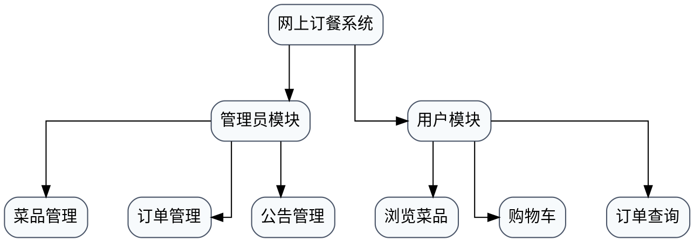
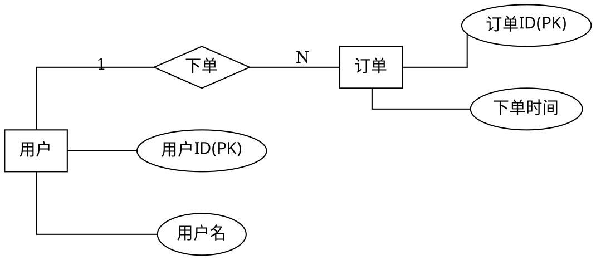

# 系统类论文图示规范

本规范用于系统型毕业论文、课程设计论文和技术报告中的四类高频图示：

- 角色用例图
- 系统架构图
- 系统功能结构图
- 数据库概念 E-R 图

## 0. 论文优先路由总则

`lunwen` 是论文图示场景的总协调器。只要任务落在论文、样文、模板、摘要、目录、参考文献或 Word 成稿上下文里，就应先按论文交付目标决定路由，再决定是否调用通用绘图能力。

固定优先级：

1. 论文章节位置、图题命名和正文衔接
2. 图示语义是否满足论文写作要求
3. 本地主产物是否能稳定插入正文（`PNG/SVG/.drawio`）
4. 最后才考虑实时会话或在线编辑体验

双 MCP 分工：

- `drawio`：基础 MCP，适合 Mermaid / XML / CSV 的打开、lightbox 查看和基础桥接导出
- `next_drawio_live`：增强 MCP，适合复杂排版、复杂正交连线、图标库精修和可编辑 `.drawio` 源输出
- 本地脚本链路：`tools/generate_drawio_assets.py`、`tools/render_graphviz.py` 等，负责把图真正落成本地产物

默认采用“单一路由优先，必要时升级 live”的策略：如果基础路由已经能满足论文插图需要，就不要额外进入 `next_drawio_live`。

## 1. 从样文中抽取出的稳定节奏

多篇系统类样文存在稳定共性：

- 用例图通常放在“系统分析”或“功能需求分析”一章，先列角色能力，再按角色放 1 张或多张用例图
- 功能结构图通常放在“系统设计”一章，常位于体系结构图之后、数据库设计之前
- 数据库设计通常按“概念结构设计 -> 逻辑结构设计 -> 数据表设计”展开
- 概念结构设计经常先画关键实体属性图，再画总体 E-R 图，随后再把 E-R 图映射到关系表
- 图题常见命名方式为：`图3-1 管理员用例图`、`图4-2 系统功能结构图`、`图4-4 系统总体E-R图`

默认写作时，应先学样文的图题格式、图所在章节、图前后说明句式，再决定是否完全沿用样文节奏。

## 2. 角色用例图规范

适用位置：

- 需求分析章
- 角色分析后
- 非功能需求前或功能模块详细设计前

固定规则：

- 参与者放在系统边界外
- 用例使用椭圆
- 系统边界使用矩形框住全部用例
- 每张图只表达一类角色或一组强相关角色
- 图前先用 1 段文字列出该角色的核心权限，再落图
- 图后默认直接进入下一角色或下一小节，不必写过长解释

常见标题：

- `图3-1 管理员用例图`
- `图3-2 用户用例图`
- `图3-3 教师/教研员用例图`

不允许：

- 用树状模块图冒充用例图
- 用流程图代替用例图
- 在用例图中塞数据库表、字段或实现细节

PlantUML 模板：

## 3. 系统功能结构图规范

适用位置：

- 系统设计章
- 体系结构图之后
- 数据库设计之前

固定规则：

- 采用自上而下的层次拆解
- 顶层节点是系统名称
- 第二层按角色或一级业务模块拆分
- 第三层展开每个一级模块的核心功能点
- 每层节点风格保持统一，优先使用矩形或圆角矩形
- 一个分支建议控制在 4-8 个核心功能点，超出则拆子图

图前建议句式：

- `结合角色需求与业务边界，系统核心功能按模块划分如下，系统功能结构图如图4-2所示。`

图后建议衔接：

- `在功能结构划分完成后，下面对各功能模块进行详细设计。`

Graphviz DOT 模板：

## 4. 系统架构图规范

适用位置：

- 系统设计章
- 体系结构设计小节
- 功能结构图之前或之后，但必须与正文解释顺序一致

固定规则：

- 优先展示系统分层、核心模块、主数据流和外部交互边界
- 只有在正文确实解释图标语义时，才引入云平台、中间件或第三方服务图标
- 论文优先场景下，主产物应先落成可插入正文的本地 `PNG` 或 `.drawio`
- 架构图不能退化为简单功能树，也不要混入数据库字段级细节

推荐路由：

- 简洁分层架构：Graphviz DOT 或 draw.io 基础图
- 图标丰富、连接复杂、需要精细排版：`next_drawio_live`

图前建议句式：

- `结合系统业务边界与部署关系，对系统总体架构进行分层设计，系统架构如图4-1所示。`

图后建议衔接：

- `在明确总体架构后，下面对功能结构与关键模块设计进行进一步说明。`

## 5. 概念 E-R 图规范

默认原则：

- 只要用户说“ER图”“E-R图”“数据库概念设计”“概念结构设计”，默认先产出概念 E-R 图
- 概念 E-R 图默认使用 Chen 记法，而不是只含表框的逻辑关系图
- 如果用户明确要求的是逻辑表关系图或物理表关系图，才允许使用全方框关系图

Chen 记法的最低要求：

- 实体：矩形
- 弱实体：双矩形
- 属性：椭圆
- 多值属性：双椭圆
- 派生属性：虚线椭圆
- 关系：菱形
- 识别关系：双菱形
- 主键属性：有明显主键标识，优先下划线或 `PK` 标识
- 基数：在边上标 `1`、`N`、`M` 或 `(min,max)`，不能完全不标

固定写法顺序：

1. 先说明数据库用于存储哪些核心业务对象
2. 再列出关键实体及主要属性
3. 先画 2-6 张关键实体属性图
4. 再画 1 张总体 E-R 图
5. 最后把 E-R 关系映射到逻辑表与外键设计

不允许：

- 用 Mermaid `erDiagram` 的表框效果直接替代概念 E-R 图
- 图里只有方框与连线，没有椭圆属性和菱形关系
- 只给总图，不说明关系到逻辑表的映射

Graphviz DOT 模板：

如果最终论文要求严格 Chen 风格，应该把主键属性改成带下划线的标签，并在需要时补双矩形、双菱形和双椭圆。

## 6. 图题与正文衔接模板

角色用例图前：

- `结合管理员与普通用户的业务职责，抽取满足系统核心需求的主要用例，角色用例图如图3-1和图3-2所示。`

功能结构图前：

- `在需求分析的基础上，对系统功能进行层次化拆分，形成如图4-2所示的系统功能结构图。`

系统架构图前：

- `结合系统运行边界、核心模块及主要交互关系，构建系统总体架构图，如图4-1所示。`

E-R 图前：

- `为清晰描述系统涉及的业务对象及其关系，采用 Chen 记法构建数据库概念模型，关键实体属性图及系统总体E-R图如下所示。`

E-R 图后：

- `在概念结构设计完成后，下面将其映射为关系模式并给出具体的数据表结构设计。`

## 7. 工具选择优先级

- 用例图：Graphviz、PlantUML、draw.io、Visio
- 系统架构图：Graphviz DOT、draw.io、Visio、`next_drawio_live`
- 功能结构图：draw.io、Graphviz DOT、Visio
- 概念 E-R 图：Graphviz DOT、draw.io、Visio、其他支持矩形/椭圆/菱形的绘图工具
- 逻辑表关系草图：Mermaid `erDiagram` 可以作为草稿或内部说明图

双 MCP 路由补充：

| 图类型 | 默认主路由 | 何时升级到 `next_drawio_live` | 默认主产物 |
| --- | --- | --- | --- |
| 关键流程图 | Mermaid + `drawio` bridge | 需要复杂布局微调或可编辑 `.drawio` | `PNG/.drawio` |
| 系统功能结构图 | Mermaid / 层次结构描述 + `drawio` bridge | 需要手工精修布局 | `PNG/.drawio` |
| 系统架构图 | Graphviz DOT 或 draw.io 基础图 | 需要图标库、复杂连线或精细分层排版 | `PNG/.drawio` |
| 用例图 | Graphviz / PlantUML 风格描述 | 参与者、系统边界和连线需要交互式精修 | `PNG/.drawio` |
| 概念 E-R 图 | Graphviz DOT | 用户明确要求可编辑 draw.io 源，且仍保留 Chen 语义 | `PNG/.drawio` |

如果论文最终要交 Word 成稿，所有图都应渲染成真实图片再插入正文，不要把源码块直接留在论文里。

## 8. draw.io PNG 产物规则

当环境需要“先出本地图片，再插论文”时，采用以下默认路由：

- 关键流程图：优先 Mermaid -> draw.io lightbox -> PNG
- 系统架构图：优先 Graphviz DOT 或 draw.io 基础图 -> 本地 `PNG/.drawio`，复杂场景再转 `next_drawio_live`
- 用例图：优先 Graphviz / PlantUML 风格结构化描述 -> 本地 `PNG`，复杂排版再转 `next_drawio_live`
- 系统功能结构图：优先 Mermaid 或层次结构描述 -> draw.io lightbox -> PNG
- 逻辑表关系图：优先 Mermaid `erDiagram` -> draw.io lightbox -> PNG
- 概念 E-R 图：优先 Graphviz DOT -> PNG，不默认走 Mermaid `erDiagram`

固定要求：

- 保留 `drawio` 作为基础 MCP，同时允许 `next_drawio_live` 作为实时会话增强通道
- draw.io 只负责增强适合 Mermaid/结构化输入的图，不替代 Chen 记法的语义约束
- 只要用户要求“概念结构设计”“系统总体E-R图”，默认仍输出带矩形/椭圆/菱形语义的概念图
- draw.io 路径和 `next_drawio_live` 路径的主交付物都必须优先落到本地 `PNG` 或 `.drawio`
- 产出的图片文件应优先接入 `image-map` 和 `.docx` 成稿流程，而不是停留在在线编辑页面
